# Multi-Tenant RAG Chatbot - System Architecture & Design

This project demonstrates a Retrieval-Augmented Generation (RAG) Chatbot, with the underlying architecture cleanly separating the system's intelligence (like LangChain and LLMs) from the actual data execution contexts using the Model Context Protocol (MCP).

This project simulates a multi-tenant platform consiting of:

- A **Central Orchestrator** which houses the LLMs, Agent flow, and the multi-tenant routing logic and handles the translation of user queries into tool calls, by first udnerstanding the query intent - which could either be a troubleshooting question, or an analytical question on tenant's own database schema or a question about the latest release features - and then accordingly routes the query to the appropriate MCP server.
- And each tenant hosts their own **MCP Server**, functioning strictly as a "dumb tool executor" hooked locally into their own isolated data silos (SQLite / ChromaDB).
- A **Redis Cache** which enables production-grade session management, preserving conversational context seamlessly across distinct user sessions.
- And a **Frontend** which serves as the user interface for the chatbot.

## Tech Stack

| Component            | Technology         | Description                                    |
| :------------------- | :----------------- | :--------------------------------------------- |
| **Frontend**         | Svelte + Vite      | Modern UI with Streaming & Markdown support.   |
| **Orchestrator**     | Python + Flask     | Central routing with Real-time SSE Streaming.  |
| **Agentic AI**       | LangChain + Gemini | **gemini-flash-latest** for LLM orchestration. |
| **Embeddings**       | Google SDK         | **models/gemini-embedding-001** for RAG.       |
| **Formatting**       | Marked.js          | Real-time markdown rendering in chat bubbles.  |
| **Storage (SQL)**    | SQLite             | Structured data silo per tenant.               |
| **Storage (Vector)** | ChromaDB           | Semantic vector search for documentation.      |
| **Caching**          | Redis              | Production-grade session & memory management.  |
| **Protocol**         | MCP (JSON-RPC)     | Standardized interface between AI and tools.   |
| **DevOps**           | Docker Compose     | Full-stack container orchestration.            |

## High-Level Flow

1.  **User Input:** The user types a query and selects a tenant silo.
2.  **Streaming Request:** Frontend opens a streaming POST request to the orchestrator.
3.  **Context & Intent:** Orchestrator fetches history from **Redis** and triggers a **Senior AI Orchestrator** prompt to classify intent.
4.  **Real-time Reasoning:** As the LLM reasons (Thought -> Action), steps are yielded instantly to the frontend via **Server-Sent Events (SSE)**.
5.  **MCP Execution:** Isolated tenant MCP servers execute SQL/Vector tools and stream observations back.
6.  **Interactive UI:** The frontend renders a typing animation, auto-expands reasoning chains, and formats the final answer using Markdown.

## Architecture Diagram

```mermaid
graph TD
    %% Define Styles
    classDef frontend fill:#3b82f6,stroke:#1d4ed8,stroke-width:2px,color:#fff
    classDef orchestrator fill:#f43f5e,stroke:#be123c,stroke-width:2px,color:#fff
    classDef backend fill:#10b981,stroke:#047857,stroke-width:2px,color:#fff
    classDef db fill:#f59e0b,stroke:#b45309,stroke-width:2px,color:#fff
    classDef llm fill:#8b5cf6,stroke:#5b21b6,stroke-width:2px,color:#fff

    %% Nodes
    User(("User 🧑‍💻"))
    UI["Frontend (Svelte) 💻"]:::frontend

    subgraph "Centralized SaaS Platform"
        Orchestrator["Central Orchestrator (SSE Streaming) 🔥"]:::orchestrator
        Gemini["Google Gemini Model ✨"]:::llm
        Redis[("Redis (Session Cache) ⚡")]:::db
    end

    subgraph "Tenant A Data Silo"
        MCP_A["Tenant A MCP Server 🛠️"]:::backend
        DB_A[("Tenant A SQLite 🗄️")]:::db
        Chroma_A[("Tenant A ChromaDB 📊")]:::db
    end

    subgraph "Tenant B Data Silo"
        MCP_B["Tenant B MCP Server 🛠️"]:::backend
        DB_B[("Tenant B SQLite 🗄️")]:::db
        Chroma_B[("Tenant B ChromaDB 📊")]:::db
    end

    %% Connections
    User -- "Natural Language Query" --> UI
    UI -- "POST /chat (Streaming SSE)" --> Orchestrator

    Orchestrator -- "Fetch/Save history" --> Redis
    Orchestrator -- "Real-time Callbacks" --> Gemini
    Gemini -- "yield Thought/Action" --> Orchestrator

    %% Multi-Tenant Routing (Addendum)
    Orchestrator -- "tools/call (JSON-RPC)" --> MCP_A
    Orchestrator -. "tools/call (JSON-RPC)" .-> MCP_B

    %% Tenant A Tools
    MCP_A -- "execute_sql" --> DB_A
    MCP_A -- "search_docs" --> Chroma_A

    %% Tenant B Tools
    MCP_B -. "execute_sql" .-> DB_B
    MCP_B -. "search_docs" .-> Chroma_B

    %% Streaming Return Path
    DB_A -- "Results" --> MCP_A
    MCP_A -- "Observation" --> Orchestrator
    Orchestrator -- "data: {thought/obs}" --> UI
    UI -- "Real-time Update" --> User
```



## Backend Services

### A. Central Orchestrator (`backend/orchestrator.py`)

- Extracted to act as the SaaS platform's brain.
- **Role:** Exposes our `/chat` UI API, processes user input, leverages LangChain and Gemini, and then makes HTTP JSON-RPC calls out to individual tenant MCP configurations depending on the tenant context passed from the UI.
- **Zero-Shot ReAct Agent:** We use a Zero-Shot ReAct (Reasoning and Acting) closed-loop LangChain agent. This represents the core intelligence of the platform:
  - **Dynamic Tool Discovery:** Instead of hardcoding tools, the orchestrator queries each Tenant's MCP server (`tools/list`) and dynamically builds proxy tools that are bound to LangChain.
  - **Reasoning Loop & Transparency:** The defined prompt forces the LLM to execute `get_database_schema` before any data queries. More impressively, by capturing _intermediate steps_, the orchestrator passes back the LLM's raw thoughts and step-by-step tool resolutions. The frontend UI renders this "Reasoning Chain" transparently to the user!
  - **Closed Loop Execution:** The agent interacts with the MCP Server iteratively until it constructs the final response.
- **Dynamic Tenant Discovery:** The orchestrator dynamically scans environment variables for the `TENANT_*_MCP_URL` pattern. This removes hardcoded endpoints and allows the platform to scale to new tenants purely through configuration in `docker-compose.yml`.
- **Real-time SSE Streaming:**
  Unlike traditional APIs that wait for the full LLM response, our orchestrator uses a **custom Callback Handler** and Python **Generators** to stream data as it's generated.
  - **StreamingCallbackHandler:** Intercepts `on_agent_action` and `on_tool_end` to capture the LLM's "inner monologue" (thoughts) and tool usage.
  - **SSE Protocol:** Uses `flask.Response(generate(), mimetype='text/event-stream')` to push JSON chunks to the Svelte frontend via a persistent HTTP connection.
- **Sophisticated System Prompting (Advanced Agentic Design):**
  We implement a high-authority system prompt that enforces strict operational protocols:
  1.  **Mandatory Intent Classification:** Every response MUST start with a classified intent (e.g., `Thought: Intent Classification: DATABASE_QUERY.`).
  2.  **Category Isolation:** If the agent identifies a database-related intent, it is **strictly forbidden** from searching documentation unless the SQL attempt fails and the user explicitly grants permission to switch categories.
  3.  **SQL Transparency:** The agent is required to explicitly describe the SQL query and its rationale in its "Thought" block before execution.
- **Production-Grade Session Management (Redis Implementation):**
  Each user interaction leverages a unique `session_id`. The backend identifies sessions using a Redis **String** data structure, where chat histories are stored as **JSON-serialized** arrays.
  - **Key Pattern:** `session:{session_id}`
  - **Sliding Window Logic:** To prevent prompt bloat and maintain relevance, the system implements a strict "last 6 messages" sliding window. Every time a new message is saved, the history is fetched, appended, and then sliced to keep only the most recent context before being re-serialized back to Redis.
  - **Automatic Expiry:** Keys are set with a **24-hour TTL** (`EX 86400`), ensuring that ephemeral chat data is automatically purged without manual maintenance.

  ```python
  # Memory Management Logic
  def save_session_memory(session_id: str, new_messages: List[Any]):
      current = get_session_memory(session_id)
      current.extend(new_messages)
      # Keep only the last 6 messages
      if len(current) > 6:
          current = current[-6:]
      REDIS_CLIENT.set(f"session:{session_id}", json.dumps(current), ex=86400)
  ```

- **Reasoning Chain & LLM Transparency:**
  The orchestrator utilizes the `return_intermediate_steps=True` flag during agent initialization. This captures the raw "thoughts" of the LLM—specifically the Plan, Tool Use, and Observation cycle of the ReAct pattern.
  - **Toolchain Construction:** Tools are not hardcoded; they are proxied from the MCP servers. A closure binds each JSON-RPC call to a standard LangChain `Tool` interface.
  - **Thought Format:** The backend extracts these steps into a structured `thoughts` array containing the tool name, the specific input generated by the LLM, and the observation (result) returned by the data silo.

    ```python
    # LangChain Agent Initialization
    agent = initialize_agent(
        tools=discovered_mcp_tools,
        llm=gemini_llm,
        agent=AgentType.ZERO_SHOT_REACT_DESCRIPTION,
        return_intermediate_steps=True, # Critical for "Thoughts" feature
        handle_parsing_errors=True
    )
    ```

- **Startup Performance Optimization (Agent Warm-up):**
  To avoid high latency on the first query, the orchestrator implements a "Warm-up" routine. Upon container startup, the system automatically:
  1. Proactively discovers tools from all configured tenant MCP servers.
  2. Pre-initializes the LangChain agents for every tenant context.
  3. Caches these agents in the `AGENT_CACHE` memory.
     This ensures that when a user sends their first message, the agent is already "warm" and ready to respond instantly.

#### The Executive System Prompt

The orchestrator uses a highly authoritative prompt to ensure logical consistency and prevent tool misuse. The prompt architecture forces a multi-step reasoning protocol:

```text
You are a senior AI orchestrator for a Multi-Tenant SaaS platform.
CORE OPERATIONAL PROTOCOLS:
1. MANDATORY INTENT CLASSIFICATION: Your VERY FIRST 'Thought' in EVERY response MUST start with: 'Intent Classification: <CATEGORY>'.
2. SQL TRANSPARENCY: When performing a DATABASE_QUERY, your 'Thought' MUST explicitly describe the SQL query you are about to run and why.
3. CATEGORY ISOLATION (STRICT):
   - If intent is DATABASE_QUERY: Use ONLY 'get_database_schema' and 'run_sql_query'. Do not automatically switch to documentation.
   - If intent is DOCUMENTATION_SEARCH: Use ONLY 'search_support_docs' and 'search_release_notes'.
4. SQL EXECUTION FLOW: Always call 'get_database_schema' once per session before running any 'run_sql_query'.
```

#### Technical Streaming Implementation (Python/SSE)

To achieve real-time transparency for both "Thoughts" and "Observations", we implemented a custom LangChain `BaseCallbackHandler` that pushes events to a thread-safe queue:

```python
# 1. Custom Handler to capture intermediate steps and tool results
class StreamingCallbackHandler(BaseCallbackHandler):
    def on_agent_action(self, action, **kwargs):
        # Extract the thought text leading up to the tool action
        thought_text = action.log.split("Action:")[0].replace("Thought:", "").strip()
        self.q.put({
            "type": "thought",
            "tool": action.tool,
            "tool_input": action.tool_input,
            "thought": thought_text
        })

    def on_tool_end(self, output, **kwargs):
        self.q.put({"type": "observation", "observation": str(output)})

# 2. Server-Sent Events (SSE) Generator
def generate():
    q = queue.Queue()
    handler = StreamingCallbackHandler(q)
    # Start the agent in a background thread
    threading.Thread(target=run_agent, args=(q, handler)).start()

    while True:
        item = q.get()
        if item is None: break # Sentinel for completion
        yield f"data: {json.dumps(item)}\n\n"
```

### B. Tenant MCP Tool Servers (`backend/mcp_server.py`)

- Designed this to be a strict implementation of JSON-RPC 2.0 without any NLP magic overlapping.
- **Role:** Pure execution. Given a `tools/call` for `execute_sql({"query": "SELECT *"})`, it executes it against SQLite and responds with results. It doesn't interpret language.
- Spun up logically per tenant via Docker, using a startup script to generate distinct tenant database objects in order to simulate a multi-tenant environment.

### C. Session Management (Redis)

- Configured as an independent container (`redis:alpine`) to act as a high-performance conversational memory buffer.
- **Role:** Pairs tightly with the Central Orchestrator, storing structured chat histories indexed by `session_id`. Enables users to hot-swap between distinct conversations in the frontend on the fly, accurately retrieving historical context in milliseconds.

### Exposed MCP Tools (Per Tenant)

1. **`execute_sql`**: Executes structured SQL queries targeting SQLite.
2. **`get_database_schema`**: Introspects database definition (tables, columns).
3. **`search_support_docs`**: Performs vector-based RAG searching against `support_docs`.
4. **`search_release_notes`**: Performs vector-based RAG searching against `release_notes`.

## Frontend Design (Svelte)

Created an aesthetic, component-based Svelte interface utilizing premium glassmorphism layouts.

### Technical Characteristics

- **Tooling:** Vite + Svelte (Vanilla JS setup).
- **Styling:** Premium Vanilla CSS with custom scrollbars, glowing borders, and chat bubble pop-in animations.
- **Session Swapping:** Intelligent hot-swapping between distinct conversations without losing UI local state.
- **Transparency:** Collapsible "Reasoning Chain" UI that iterate through the backend's `thoughts` response. This allows users to verify exactly which SQL queries were run or which documentation was retrieved.
- **UI Feedback & Aesthetics:**
  - **Typing Indicator Component:** A dedicated `TypingIndicator.svelte` component provides immediate pulsing animation after a message is sent, eliminating perceived latency.
  - **Intelligent Auto-Expansion:** The reasoning section automatically expands when the first thought arrives (but can be manually closed).
  - **SQL Formatting:** The UI detects `run_sql_query` actions and renders the input as formatted SQL code blocks.
  - **Markdown & Code Rendering:** Integrated `marked.js` to render rich text, lists, and code blocks from the LLM's final answers.

  ```svelte
  <!-- Svelte 5 logic for rendering reasoning -->
  {#if thoughts.length > 0 && showThoughts}
    <div class="thoughts-content" transition:slide>
      {#each thoughts as thought, i}
        <div class="thought-step">
          <span class="step-num">{i + 1}</span>
          <div class="thought-details">
            <strong>Used tool: {thought.tool}</strong>
            <div class="tool-obs">Observation: {thought.observation}</div>
          </div>
        </div>
      {/each}
    </div>
  {/if}
  ```

### Component Structure

1.  **`App.svelte`**: Main stateful orchestrator that contains the chat layout and session management.
2.  **`ChatWindow.svelte`**: Renders a list of Message blocks, auto-scrolling to the latest input.
3.  **`ChatMessage.svelte`**: Presents individual chat bubbles + the intermediate thinking steps.
4.  **`ChatInput.svelte`**: Modern input handler for message submission.

## Getting Started

### 1. Environment Setup

The system requires a Google Gemini API Key for the AI orchestration.

1.  Create a file named `.env` in the root directory.
2.  Add your API key to the file (you can use `.env.example` as a template):
    ```bash
    GEMINI_API_KEY=your_actual_api_key_here
    ```

## Dockerized Deployment

The entire platform runs effortlessly using Docker Compose, simulating a distributed ecosystem:

- Ensure you have Docker and Docker Compose installed.
- Running `docker-compose up -d` handles all container mapping and orchestration smoothly.
- It spins up the Svelte frontend (`:5173`), the Orchestrator API (`:5000`), a dedicated Redis cache (`:6379`), Tenant A's isolated MCP server (`:3001`), and Tenant B's isolated MCP server (`:3002`), effectively establishing absolute data isolation while sharing orchestration processing!

## Full Project Dependencies

### Backend (Python 3.10+)

Included in `backend/requirements.txt`:

- `flask` (v3.0.0): Web framework for orchestrator and MCP servers.
- `flask-cors` (v4.0.0): Handles cross-origin requests.
- `langchain` (v0.1.0+): Core agent orchestration.
- `langchain-google-genai`: Google Gemini integration.
- `langchain-community`: Community-contributed tools and integrations.
- `chromadb` (v0.4.22): Vector database for documentation search.
- `google-generativeai`: Direct Google AI SDK.
- `redis` (v5.0.1): Session persistence.
- `pyyaml`: Configuration parsing.
- `requests`: Internal RPC communication.

### Frontend (Svelte 5)

Included in `frontend/package.json`:

- `svelte` (v5.45.2): UI framework utilizing the new Runes API (`$state`, `$effect`).
- `vite` (v7.3.1): Frontend build tool and development server.
- `@sveltejs/vite-plugin-svelte`: Svelte integration for Vite.

## Project Evolution Summary

This project evolved from a standard RAG bot into a production-ready multi-tenant orchestrator featuring:

- ✅ **SSE Streaming** for zero-latency feedback.
- ✅ **Advanced System Prompting** for intent-based tool isolation.
- ✅ **Rich UI feedback** including typing animations and SQL transparency.
- ✅ **Svelte 5 Runes** for high-performance reactive state management.
